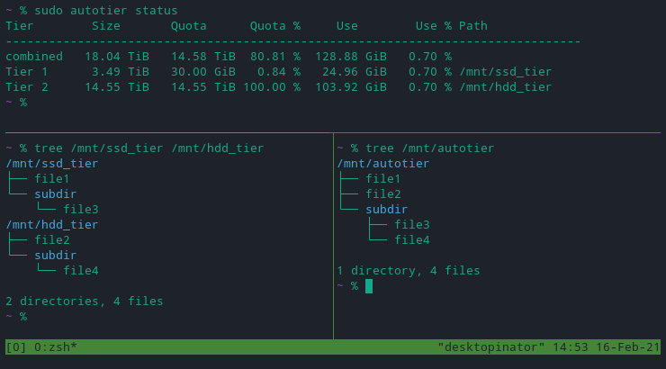

# autotier
A passthrough FUSE filesystem that intelligently moves files between storage tiers based on frequency of use, file age, and tier fullness.

## What it does
`autotier` is a tiered FUSE filesystem which acts as a merging passthrough to any number of underlying filesystems. These underlying filesystems can be of any type. Behind the scenes, `autotier` moves files around such that the most often accessed files are kept in the highest tier. `autotier` fills each defined tier up to their watermarked capacity, starting at the fastest tier with the highest priority files. If you do a lot of writing, set a lower watermark for the highest tier to allow for more room. If you do mostly reading, set a higher watermark to allow for as much use as possible out of your available top tier storage.  


## Installation
```
yum install https://github.com/45Drives/autotier/releases/download/v0.7.1-beta/autotier-0.7.1-1.el8.x86_64.rpm
```

For apt-get based systems, or building from source:

```
#Change to home directory
cd ~
#Clone autotier github to ~/autotier
git clone https://github.com/45Drives/autotier.git
#Change directory into ~/autotier
cd autotier
#Install requirements
sudo apt-get install libboost-all-dev lsof -y
#Compile
make
```

You will need to create the `/etc/autotier.conf` config file, place `autotier` in `/usr/local/bin/` and set up a systemd service to execute `autotier run`.


## Usage
The RPM install package includes a systemd unit file. Configure `autotier` as described below and enable the daemon with `systemctl enable autotier` The default configuration file is `/etc/autotier.conf`, but this can be changed by passing the `-c`/`--config` flag followed by the path to the alternate configuration file. The first defined tier should be the working tier that is exported. So far, `samba` is the only sharing tool that seems to work with this software. `nfs` is too literal, and has no capability of following wide symlinks.

### Command Line Tools
```
Usage:
  autotier <command> [<flags>]
Commands:
  oneshot     - execute tiering only once
  run         - start tiering of files as daemon
  status      - list info about defined tiers
  pin <"tier name"> <"path/to/file">...
              - pin file(s) to tier using tier name in config file
              - if a path to a directory is passed, all top-level files
                will be pinned
              - "path/to/file" must be relative to the autotier mountpoint
  unpin <path/to/file>...
              - remove pin from file(s)
              - "path/to/file" must be relative to the autotier mountpoint
  config      - display current configuration file
  list-pins   - show all pinned files
  list-popularity
              - print list of all tier files sorted by frequency of use
  help        - display this message
Flags:
  -h, --help  - display this message and cancel current command
  -c, --config <path/to/config>
              - override configuration file path (default /etc/autotier.conf)
  -m, --mountpoint <path/to/mountpoint>
              - override mountpoint from configuration file
  -o, --fuse-options <comma,separated,list>
              - mount options to pass to fuse (see man mount.fuse)
  --verbose   - set log level to 2
  --quiet     - set log level to 0 (no output)
```
Examples:  
Run tiering of files in daemon mode:  
`autotier run`  
Run tiering of files only once:  
`autotier oneshot`  
Show status of configured tiers:  
`autotier status`  
Pin a file to a tier with \<Tier Name\>:  
`autotier pin "<Tier Name>" path/to/file`  
Pin multiple files:  
`autotier pin "<Tier Name>" path/to/file1 path/to/dir/* bash/expansion/**/*`  
`find path/* -type f -print | xargs autotier pin "<Tier Name>"`  
Remove pins:  
`autotier unpin path/to/file`  
`find path/* -type f -print | xargs autotier unpin`  
List pinned files:  
`autotier list-pins`


## Configuration
### Autotier Config
#### Global Config
For global configuration of `autotier`, options are placed below the `[Global]` header. Example:
```
[Global]            # global settings
LOG_LEVEL=1         # 0 = none, 1 = normal, 2 = debug
TIER_PERIOD=5       # number of seconds between file move batches
MOUNT_POINT=/mnt/autotier
```
The global config section can be placed before, after, or between tier definitions.
#### Tier Config
The layout of a single tier's configuration entry is as follows:
```
[<Tier name>]
DIR=/path/to/storage/tier
WATERMARK=<0-100% of tier usage at which to stop filling tier>
```
As many tiers as desired can be defined in the configuration, however they must be in order of fastest to slowest. The tier's name can be whatever you want but it cannot be `global` or `Global`. Tier names are only used for config diagnostics and file pinning.  
Below is a complete example of a configuration file:
```
# autotier.conf
[Global]            # global settings
LOG_LEVEL=1         # 0 = none, 1 = normal, 2 = debug
TIER_PERIOD=100     # number of seconds between file move batches
MOUNT_POINT=/mnt/autotier

[Fastest Tier]
DIR=/mnt/tier1     # fast tier storage pool
WATERMARK=70        # keep tier usage just below 70%

[Medium Tier]
DIR=/mnt/tier2
WATERMARK=90

[Slower Tier]
DIR=/mnt/tier3
WATERMARK=100

# ... and so on
```
---
```
    🕯️
  ╒════╕
  │ 45 │
 ╒╧════╧╕
 │DRIVES│
╒╧══════╧╕
│AUTOTIER│
╘════════╛
```
[](https://www.45drives.com)
